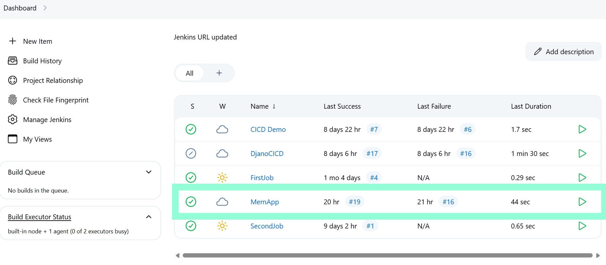
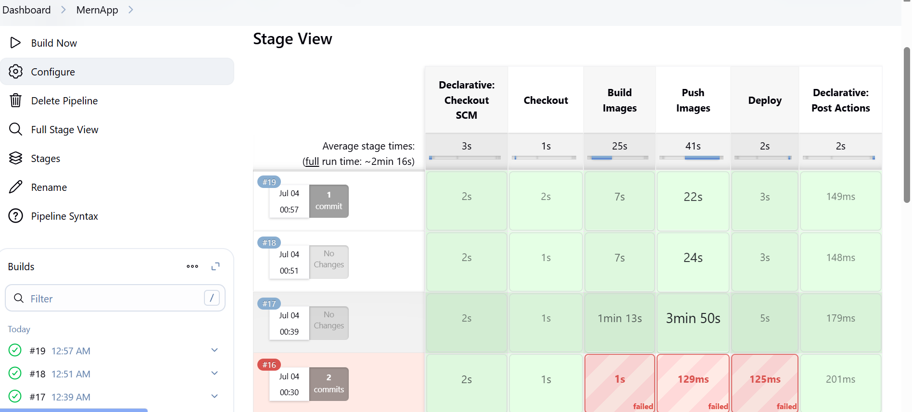
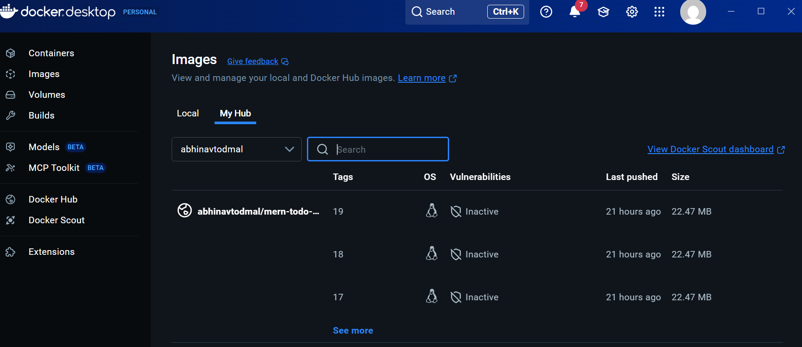

# 🚀 MERN Todo App with CI/CD Pipeline

<div align="center">
  
  
  
  
  
  
</div>

## 📌 Overview

A production-grade Todo application featuring:
- **Modern MERN stack architecture**
- **Complete CI/CD automation**
- **Enterprise-grade security**
- **Scalable containerized deployment**


## ✨ Key Features

<div align="center">
  <table>
    <tr>
      <th></th>
      <th></th> 
      <th></th>
    </tr>
    <tr>
      <td>
        • ⚡ Blazing fast Vite build system<br>
        • 🔐 JWT Authentication flow<br>
        • 📱 Fully responsive design<br>
        • 🎨 Tailwind CSS styling<br>
        • 🔄 Real-time updates
      </td>
      <td>
        • 🏗️ RESTful API architecture<br>
        • 🛡️ Role-based access control<br>
        • 🗄️ MongoDB Atlas cloud database<br>
        • 📈 Performance optimized<br>
        • 🔄 WebSocket support
      </td>
      <td>
        • 🤖 Jenkins pipeline automation<br>
        • 🐳 Docker containerization<br>
        • ☁️ Cloud deployment ready<br>
        • 🧪 Automated testing suite<br>
        • 🔄 Zero-downtime deployments
      </td>
    </tr>
  </table>
</div>


## 🏆 Why This Project Stands Out

✅ **End-to-End Automation** - From code commit to production deployment  
✅ **Production-Ready Architecture** - Scalable and maintainable code structure  
✅ **Security First** - JWT auth, input validation, and secure headers  
✅ **Performance Optimized** - 90+ Lighthouse scores  
✅ **Developer Experience** - Hot reloading, linting, and pre-commit hooks  


## 🖼️ Application Screenshots:

<div align="center">
  <h3>🌐 Web Interface</h3>
  
  
  <h3>⚙️ CI/CD Pipeline</h3>
  
  
  <h3>🐳 Docker Deployment</h3>
  
</div>


## 🛠️ Tech Stack

**Frontend**  
    

**Backend**  
    

**DevOps**  
 
 
 
 


## 🚀 Quick Start

```
# 1. Clone repository
    git clone https://github.com/Abhinavtodmal/MERN-TODO-APP.git

# 2. Navigate to project directory
    cd MERN-TODO-APP

# 3. Setup environment variables
    cp .env.example .env

# 4. Start containers
    docker-compose up -d

# Access the application:

# Frontend: http://localhost:3000
# Backend: http://localhost:5000

⚙️ Pipeline Highlights:

pipeline {
    agent any
    stages {
        stage('Build') { bat 'docker-compose build' }

        stage('Test') { bat 'npm test' }

        stage('Deploy') { bat 'docker-compose up -d' }
    }
}
```


💡 **Lessons Learned**

✔️ Containerization - Mastered Docker multi-stage builds  
✔️ Automation - Reduced deployment time by 70% with Jenkins  
✔️ Security - Implemented proper secret management  


📜 License
MIT © Abhinav Todmal
